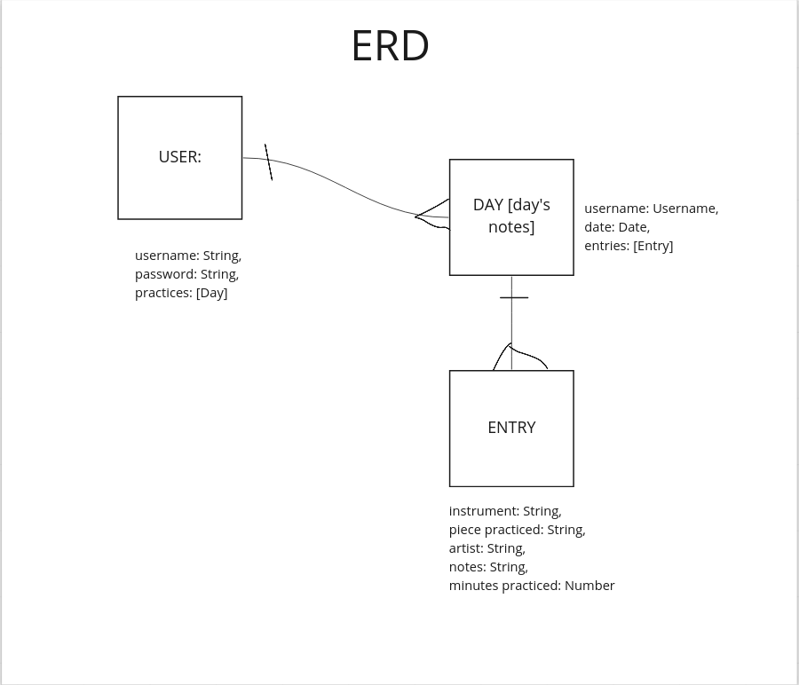

# Practice Helper App

# TODO:
- limit viewed practice entries to logged in user
- greet user after login
- redirect login page to practice page if already logged in
- delete all entries in practice w button
- Create dark mode (https://css-tricks.com/a-complete-guide-to-dark-mode-on-the-web/#toggling-themes)
- hook up API (open opus)
- enable search functionality w/API (update user stories)

# Purpose
To improve as a musician, consistent practice is key! The best thing you can do to assist in that is to keep detailed practice notes: keeping detailed notes about what precisely you have practiced, at what tempo, and for how long, all come in handy when it comes to improving for the hobby musician or the professional player. This app is here to help! Detailed notes broken down by day and piece, that are easily reviewed, will help you improve as a musician. Enjoy!

# User stories: (`As a user...`)
- Create/Post a Day's practice (2 routes in one!)
    - new schema
    - create a model to use
    - return newly created Practice
- Create/Post an entry inside of a practice (2 routes in one!)
    - new schema
    - create a model to use
    - STRETCH: link with API for open music so it will suggest what you're working on??
    - return newly created note inside the practice
- View all practices
    - query all practices in collection - find()
    - return all practices
- View all entry per practice
    - query all entry in collection - find()
    - return all entry
- View single practice
    - query for single practice - findOne() .id / name?
    - return single correct practice
- View single entry
    - query for single entry - findOne() .id / name?
    - return single correct entry
- Update/Post single practice (2 routes in one!)
    - query for single practice in collection - .id / name?
    - update that single practice
    - return updated practice
- Update/Post single entry inside practice (2 routes in one!)
    - query for single entry in collection - .id / name?
    - update that single entry inside practice
    - return updated entry
- Delete a single entry
    - query for single entry in collection - .id / name?
    - delete or remove a single entry
    - return a success of some kind
- Delete a single practice
    - query for single practice in collection - .id / name?
    - delete or remove a single practice
    - return a success of some kind
- Delete ALL notes in practice
    - query for all notes in practice - .id
    - delete/remove ALL notes
    - return a success of some kind
- View collection of stats for all user's practice stats

# Whiteboard

-https://miro.com/app/board/uXjVOmuG6zM=/?share_link_id=766756207036

Start Screen

Sign In

Sign Up

Log-In Screen

User Home

Note Adding Page

Practice Review

ERD

# External API Used
- https://openopus.org/

# Routes Table for Overall Practice

|   NAME   |     PATH           | HTTP VERB |            PURPOSE                    |
|----------|--------------------|-----------|---------------------------------------| 
| Index    | /practice          |    GET    | Displays all practice entries         |
| New      | /practice/new      |    GET    | Shows new form for new practice entry |
| Create   | /practice          |   POST    | Creates a new practice post           |
| Show     | /practice/:id      |    GET    | Shows one specified practice post     |
| Edit     | /practice/:id/edit |    GET    | Shows edit form for one practice post |
| Update   | /practice/:id      |    PUT    | Updates a particular practice post    |
| Destroy  | /practice/:id      |  DELETE   | Deletes a particular practice post    |